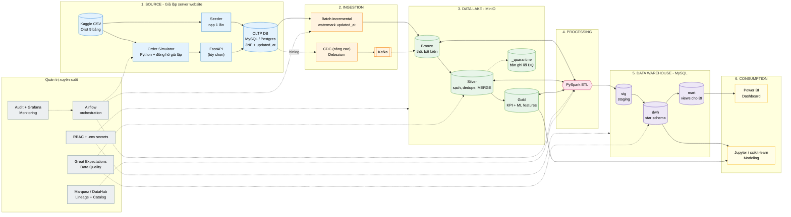
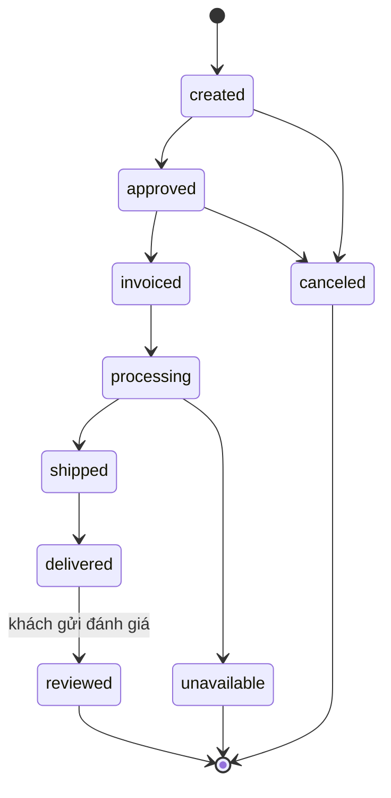
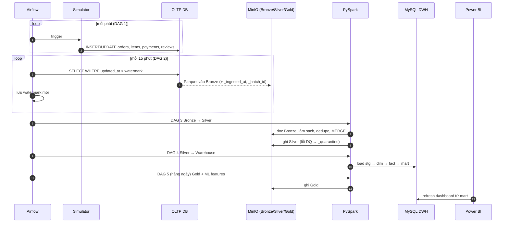
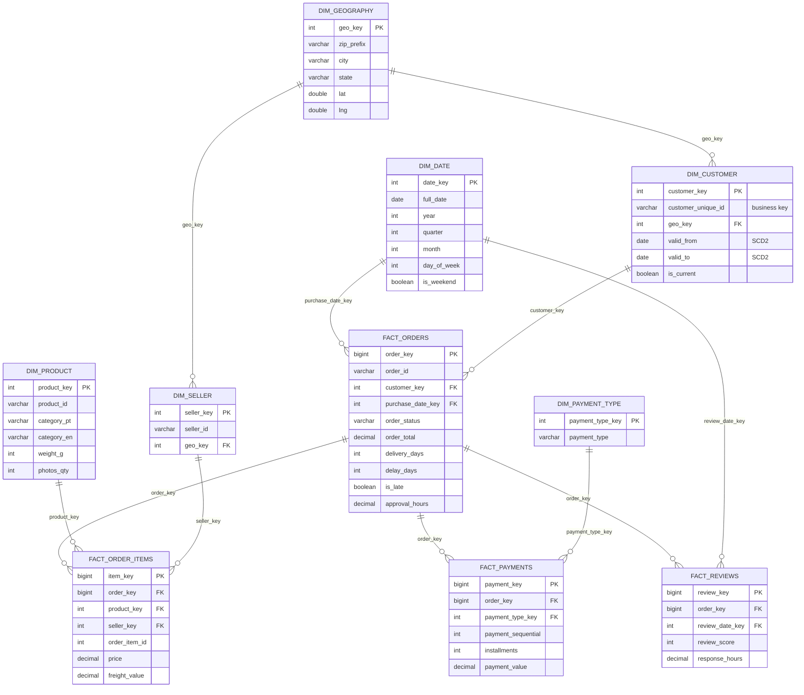

# Sơ đồ kiến trúc (Mermaid)

## 1. Kiến trúc tổng thể

```mermaid
flowchart LR
    subgraph SRC["1. SOURCE - Giả lập server website"]
        CSV[("Kaggle CSV<br/>Olist 9 bảng")]
        SEED["Seeder<br/>nạp 1 lần"]
        SIM["Order Simulator<br/>Python + đồng hồ giả lập"]
        API["FastAPI<br/>(tùy chọn)"]
        OLTP[("OLTP DB<br/>MySQL / Postgres<br/>3NF + updated_at")]
        CSV --> SEED --> OLTP
        CSV --> SIM --> API --> OLTP
    end

    subgraph ING["2. INGESTION"]
        BATCH["Batch incremental<br/>watermark updated_at"]
        CDC["CDC (nâng cao)<br/>Debezium"]
        KAFKA[["Kafka"]]
        CDC --> KAFKA
    end

    subgraph LAKE["3. DATA LAKE - MinIO"]
        BRONZE[("Bronze<br/>thô, bất biến")]
        SILVER[("Silver<br/>sạch, dedupe, MERGE")]
        GOLD[("Gold<br/>KPI + ML features")]
        QUAR[("_quarantine<br/>bản ghi lỗi DQ")]
        BRONZE --> SILVER --> GOLD
        SILVER -.-> QUAR
    end

    subgraph PROC["4. PROCESSING"]
        SPARK{{"PySpark ETL"}}
    end

    subgraph DWH["5. DATA WAREHOUSE - MySQL"]
        STG[("stg<br/>staging")]
        CORE[("dwh<br/>star schema")]
        MART[("mart<br/>views cho BI")]
        STG --> CORE --> MART
    end

    subgraph USE["6. CONSUMPTION"]
        BI["Power BI<br/>Dashboard"]
        ML["Jupyter / scikit-learn<br/>Modeling"]
    end

    OLTP --> BATCH
    OLTP -. binlog .-> CDC
    BATCH --> BRONZE
    KAFKA -.-> BRONZE

    BRONZE <--> SPARK
    SILVER <--> SPARK
    GOLD <--> SPARK
    SPARK --> STG

    MART --> BI
    CORE --> ML
    GOLD --> ML

    subgraph GOV["Quản trị xuyên suốt"]
        AF["Airflow<br/>orchestration"]
        DQ["Great Expectations<br/>Data Quality"]
        LIN["Marquez / DataHub<br/>Lineage + Catalog"]
        MON["Audit + Grafana<br/>Monitoring"]
        SEC["RBAC + .env secrets"]
    end

    AF -.-> SIM
    AF -.-> BATCH
    AF -.-> SPARK
    DQ -.-> SILVER
    DQ -.-> CORE
    LIN -.-> SPARK
    MON -.-> AF
    SEC -.-> LAKE
    SEC -.-> DWH

    classDef src fill:#e3f2fd,stroke:#1976d2,color:#000
    classDef ing fill:#fff3e0,stroke:#f57c00,color:#000
    classDef lake fill:#e8f5e9,stroke:#388e3c,color:#000
    classDef proc fill:#fce4ec,stroke:#c2185b,color:#000
    classDef dwh fill:#ede7f6,stroke:#512da8,color:#000
    classDef use fill:#fffde7,stroke:#fbc02d,color:#000
    classDef gov fill:#eceff1,stroke:#607d8b,color:#000
    class CSV,SEED,SIM,API,OLTP src
    class BATCH,CDC,KAFKA ing
    class BRONZE,SILVER,GOLD,QUAR lake
    class SPARK proc
    class STG,CORE,MART dwh
    class BI,ML use
    class AF,DQ,LIN,MON,SEC gov
```

## 2. Vòng đời đơn hàng do Simulator sinh ra

```mermaid
stateDiagram-v2
    [*] --> created
    created --> approved
    approved --> invoiced
    invoiced --> processing
    processing --> shipped
    shipped --> delivered
    created --> canceled
    approved --> canceled
    processing --> unavailable
    delivered --> reviewed: khách gửi đánh giá
    reviewed --> [*]
    canceled --> [*]
    unavailable --> [*]
```

## 3. Luồng chạy theo thời gian (Airflow DAGs)

```mermaid
sequenceDiagram
    autonumber
    participant AF as Airflow
    participant SIM as Simulator
    participant DB as OLTP DB
    participant LK as MinIO (Bronze/Silver/Gold)
    participant SP as PySpark
    participant DW as MySQL DWH
    participant BI as Power BI

    loop mỗi phút (DAG 1)
        AF->>SIM: trigger
        SIM->>DB: INSERT/UPDATE orders, items, payments, reviews
    end
    loop mỗi 15 phút (DAG 2)
        AF->>DB: SELECT WHERE updated_at > watermark
        DB-->>LK: Parquet vào Bronze (+ _ingested_at, _batch_id)
        AF->>AF: lưu watermark mới
    end
    AF->>SP: DAG 3 Bronze → Silver
    SP->>LK: đọc Bronze, làm sạch, dedupe, MERGE
    SP->>LK: ghi Silver (lỗi DQ → _quarantine)
    AF->>SP: DAG 4 Silver → Warehouse
    SP->>DW: load stg → dim → fact → mart
    AF->>SP: DAG 5 (hằng ngày) Gold + ML features
    SP->>LK: ghi Gold
    BI->>DW: refresh dashboard từ mart
```

## 4. Star schema trong Data Warehouse

```mermaid
erDiagram
    DIM_DATE ||--o{ FACT_ORDERS : "purchase_date_key"
    DIM_CUSTOMER ||--o{ FACT_ORDERS : customer_key
    DIM_GEOGRAPHY ||--o{ DIM_CUSTOMER : geo_key
    DIM_GEOGRAPHY ||--o{ DIM_SELLER : geo_key

    FACT_ORDERS ||--o{ FACT_ORDER_ITEMS : order_key
    DIM_PRODUCT ||--o{ FACT_ORDER_ITEMS : product_key
    DIM_SELLER ||--o{ FACT_ORDER_ITEMS : seller_key

    FACT_ORDERS ||--o{ FACT_PAYMENTS : order_key
    DIM_PAYMENT_TYPE ||--o{ FACT_PAYMENTS : payment_type_key

    FACT_ORDERS ||--o{ FACT_REVIEWS : order_key
    DIM_DATE ||--o{ FACT_REVIEWS : review_date_key

    FACT_ORDERS {
        bigint order_key PK
        varchar order_id
        int customer_key FK
        int purchase_date_key FK
        varchar order_status
        decimal order_total
        int delivery_days
        int delay_days
        boolean is_late
        decimal approval_hours
    }
    FACT_ORDER_ITEMS {
        bigint item_key PK
        bigint order_key FK
        int product_key FK
        int seller_key FK
        int order_item_id
        decimal price
        decimal freight_value
    }
    FACT_PAYMENTS {
        bigint payment_key PK
        bigint order_key FK
        int payment_type_key FK
        int payment_sequential
        int installments
        decimal payment_value
    }
    FACT_REVIEWS {
        bigint review_key PK
        bigint order_key FK
        int review_date_key FK
        int review_score
        decimal response_hours
    }
    DIM_CUSTOMER {
        int customer_key PK
        varchar customer_unique_id "business key"
        int geo_key FK
        date valid_from "SCD2"
        date valid_to "SCD2"
        boolean is_current
    }
    DIM_SELLER {
        int seller_key PK
        varchar seller_id
        int geo_key FK
    }
    DIM_PRODUCT {
        int product_key PK
        varchar product_id
        varchar category_pt
        varchar category_en
        int weight_g
        int photos_qty
    }
    DIM_GEOGRAPHY {
        int geo_key PK
        varchar zip_prefix
        varchar city
        varchar state
        double lat
        double lng
    }
    DIM_DATE {
        int date_key PK
        date full_date
        int year
        int quarter
        int month
        int day_of_week
        boolean is_weekend
    }
    DIM_PAYMENT_TYPE {
        int payment_type_key PK
        varchar payment_type
    }
```
